### 数据模型与实体关系图

```mermaid
erDiagram
    USER {
        UUID id PK
        string username
        string email
        string hashed_password
        string full_name
        string avatar_url
        JSONB settings
        bool is_active
        bool is_superuser
        timestamptz created_at
        timestamptz updated_at
        timestamptz last_login_at
        bigint storage_used
        int api_calls_count
    }
    KNOWLEDGE_BASE {
        UUID id PK
        UUID user_id FK
        string name
        string description
        string icon_url
        string status
        timestamptz created_at
        timestamptz updated_at
        int document_count
        bigint total_size_bytes
        int chunk_count
        timestamptz last_updated_at
        JSONB settings
    }
    DOCUMENT {
        UUID id PK
        UUID knowledge_base_id FK
        UUID uploaded_by FK
        string filename
        string file_type
        bigint file_size
        string file_path
        string mime_type
        string file_hash
        string status
        int progress
        string error_message
        timestamptz processed_at
        JSONB metadata
        JSONB chunking_config
        int chunk_count
        timestamptz created_at
        timestamptz updated_at
    }
    DOCUMENT_CHUNK {
        UUID id PK
        UUID document_id FK
        UUID knowledge_base_id FK
        UUID user_id FK
        text content
        string content_hash
        int chunk_index
        vector content_embedding
        vector summary_embedding
        string embedding_model
        JSONB metadata
        UUID parent_chunk_id FK
        timestamptz created_at
    }
    API_KEY {
        UUID id PK
        UUID user_id FK
        UUID knowledge_base_id FK
        string name
        string description
        string key_hash
        string key_prefix
        string key_suffix
        JSONB scopes
        int rate_limit
        int daily_quota
        int monthly_quota
        int usage_count_today
        int usage_count_month
        bool is_active
        timestamptz expires_at
        timestamptz last_used_at
        string last_used_ip
        timestamptz created_at
        JSONB security
    }
    API_USAGE_LOG {
        UUID id PK
        UUID api_key_id FK
        UUID user_id FK
        string endpoint
        string method
        JSONB request_body
        int status_code
        int response_time_ms
        string error_message
        string ip_address
        string user_agent
        timestamptz created_at
    }

    USER ||--o{ KNOWLEDGE_BASE : owns
    USER ||--o{ DOCUMENT : uploads
    USER ||--o{ DOCUMENT_CHUNK : owns
    USER ||--o{ API_KEY : owns
    USER ||--o{ API_USAGE_LOG : owns

    KNOWLEDGE_BASE ||--o{ DOCUMENT : contains
    KNOWLEDGE_BASE ||--o{ DOCUMENT_CHUNK : has

    DOCUMENT ||--o{ DOCUMENT_CHUNK : splits_into

    API_KEY }|--|| KNOWLEDGE_BASE : scopes_to
    API_KEY ||--o{ API_USAGE_LOG : records

    DOCUMENT_CHUNK ||--o{ DOCUMENT_CHUNK : parent_of
```



---

## 核心实体说明

### 1. USER (用户表)
- 存储用户认证和个人信息
- `settings` (JSONB): 用户偏好配置
- `storage_used`: 用户已使用存储空间（触发器维护）
- 数据隔离：所有资源通过 `user_id` 隔离

### 2. KNOWLEDGE_BASE (知识库表)
- 文档集合的容器
- `status`: `active` | `archived`
- `settings` (JSONB): 包含分块配置、embedding配置、搜索配置
  - `chunking_config`: 默认分块策略配置
  - `embedding_config`: embedding模型配置
  - `search_config`: 搜索默认配置

### 3. DOCUMENT (文档表)
- 文档元数据和处理状态
- `status`: `pending` | `processing` | `completed` | `failed`
- `chunking_config` (JSONB): 文档级分块配置（可选，默认继承知识库配置）
- `file_hash`: SHA256哈希，用于去重

### 4. DOCUMENT_CHUNK (文档分块表)
- 分块内容和向量数据
- `content_embedding`: pgvector(1024维，bge-m3模型)
- `summary_embedding`: pgvector(1024维，摘要向量)
- `embedding_model`: 默认 `BAAI/bge-m3`
- `content_hash`: 分块去重
- `parent_chunk_id`: 支持层级分块
- 冗余 `knowledge_base_id` 和 `user_id` 字段以提升查询性能

### 5. API_KEY (API密钥表)
- 外部API访问管理
- `key_hash`: SHA256哈希，不存储明文
- `scopes`: 权限数组 `["search", "upload", "read", "delete"]`
- `knowledge_base_id`: 可选，限定访问范围

### 6. API_USAGE_LOG (API使用日志表)
- API调用记录
- 成功日志保留30天，错误日志保留90天

---

## 关键索引

```sql
-- 向量搜索（HNSW索引）
CREATE INDEX idx_chunks_embedding_hnsw ON document_chunks 
USING hnsw (embedding vector_cosine_ops) WITH (m = 16, ef_construction = 64);

-- 全文搜索
CREATE INDEX idx_chunks_content_fts ON document_chunks 
USING gin(to_tsvector('chinese', content));

-- 常规索引
CREATE INDEX idx_kb_user ON knowledge_bases(user_id);
CREATE INDEX idx_doc_kb_status ON documents(knowledge_base_id, status);
CREATE INDEX idx_chunks_kb_user ON document_chunks(knowledge_base_id, user_id);
CREATE INDEX idx_apikey_hash ON api_keys(key_hash);
```

---

## 关键触发器

```sql
-- 1. 更新知识库统计
CREATE TRIGGER trg_doc_kb_stats AFTER INSERT OR DELETE ON documents
FOR EACH ROW EXECUTE FUNCTION update_kb_stats();

-- 2. 更新用户存储使用量
CREATE TRIGGER trg_user_storage AFTER INSERT OR DELETE ON documents
FOR EACH ROW EXECUTE FUNCTION update_user_storage();

-- 3. 更新文档分块数量
CREATE TRIGGER trg_doc_chunk_count AFTER INSERT OR DELETE ON document_chunks
FOR EACH ROW EXECUTE FUNCTION update_doc_chunk_count();
```

---

## 分块配置结构

知识库或文档中的 `chunking_config` (JSONB) 结构：

```json
{
  "strategy_type": "paragraph",
  "config": {
    "max_chunk_size": 800,
    "min_chunk_size": 100,
    "merge_short_paragraphs": true
  },
  "nl_description": "按照段落分块，每个分块最多包含3个段落",
  "llm_provider": "qwen",
  "generation_reasoning": "..."
}
```

**支持的策略类型**:
- `fixed`: 固定长度分块
- `paragraph`: 段落分块
- `semantic`: 语义分块
- `sliding_window`: 滑动窗口分块
- `custom`: 自定义分块

---

## 数据隔离策略

- 所有查询必须带上 `user_id` 过滤
- 冗余 `user_id` 字段避免JOIN，提升性能
- API Key 自动关联到用户，验证时检查所有权

