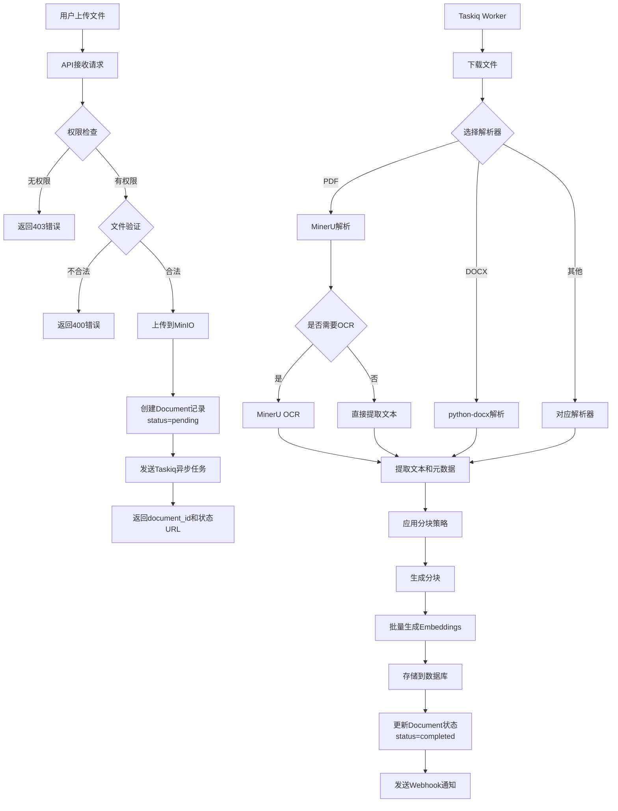
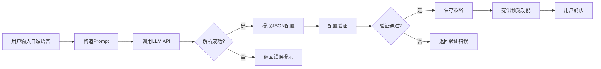

## AI知识库管理平台 PRD

### 一、产品概述

#### 1.1 产品定位
企业级知识库管理平台后端系统，支持智能文档处理、自然语言定义分块策略、灵活的权限控制和API服务能力。

#### 1.2 核心价值
- **智能文档处理**：支持多格式文档解析，包括OCR识别
- **灵活分块策略**：支持自然语言描述定义分块规则
- **高效检索**：基于向量的语义搜索
- **开放API**：支持导出知识库为API服务
- **私有化部署**：基于Docker的完整部署方案

#### 1.3 技术栈

| 组件类别 | 技术选型 | 版本/说明 |
|---------|---------|----------|
| **后端框架** | FastAPI | 异步高性能框架 |
| **数据库** | PostgreSQL + pgvector | 关系型数据库 + 向量扩展 |
| **对象存储** | MinIO | S3兼容的开源对象存储 |
| **异步任务** | Taskiq + Redis | 分布式任务队列 |
| **Embedding** | Qwen Embedding API | 通义千问向量模型（1536维） |
| **LLM** | 多模型支持 | 通义千问/GPT-4/Claude/文心一言 |
| **OCR解析** | MinerU | 开源文档解析工具 |
| **监控** | Prometheus + Grafana | 指标采集与可视化 |
| **日志** | 结构化日志 + Loki（可选） | JSON格式日志 |
| **部署** | Docker + Docker Compose | 容器化部署 |

---

### 二、功能需求

#### 2.1 用户管理模块

##### 2.1.1 用户实体设计

```
User 实体字段：
├── 基本信息
│   ├── id (UUID)
│   ├── username (唯一)
│   ├── email (唯一)
│   ├── hashed_password
│   ├── full_name
│   └── avatar_url
├── 配置信息
│   └── settings (JSONB)
│       ├── default_chunking_strategy_id
│       ├── preferred_llm_provider
│       └── api_quota_limit
├── 状态信息
│   ├── is_active
│   ├── is_superuser
│   ├── created_at
│   ├── updated_at
│   └── last_login_at
└── 统计信息
    ├── storage_used (bytes)
    └── api_calls_count
```

##### 2.1.2 功能点

| 功能 | 说明 | 优先级 |
|-----|------|--------|
| 用户注册 | 邮箱注册，密码强度验证 | P0 |
| 用户登录 | JWT Token认证，24小时有效期 | P0 |
| 密码重置 | 邮件验证码重置 | P1 |
| 个人信息管理 | 修改昵称、头像等 | P1 |
| 偏好设置 | 默认分块策略、LLM选择等 | P1 |
| 数据隔离 | 所有资源按user_id完全隔离 | P0 |

##### 2.1.3 数据隔离策略

- **原则**：每个用户的数据完全隔离，互不可见
- **实现**：所有资源表（知识库、文档、分块等）都包含 `user_id` 字段
- **查询**：所有查询必须带上 `user_id` 过滤条件
- **共享**：通过权限表实现跨用户的知识库共享

---

#### 2.2 权限管理模块（RBAC）

##### 2.2.1 角色定义

**系统级角色**：
- `SUPER_ADMIN`：系统管理员，可管理所有用户和资源
- `USER`：普通用户，只能管理自己的资源

---

#### 2.3 知识库管理模块

##### 2.3.1 知识库实体设计

```
KnowledgeBase 实体字段：
├── 基本信息
│   ├── id (UUID)
│   ├── user_id (所有者)
│   ├── name (名称，最多100字符)
│   ├── description (描述，最多500字符)
│   └── icon_url (图标URL，可选)
├── 状态信息
│   ├── status (active/archived)
│   ├── created_at
│   └── updated_at
├── 统计信息
│   ├── document_count (文档数量)
│   ├── total_size_bytes (总存储大小)
│   ├── chunk_count (分块总数)
│   └── last_updated_at (最后更新时间)
└── 配置信息 (JSONB)
    └── settings
        ├── default_chunking_strategy_id (默认分块策略)
        ├── embedding_config
        │   ├── model: "qwen-embedding-v2"
        │   └── dimension: 1536
        └── search_config
            ├── top_k: 10 (默认返回结果数)
            ├── similarity_threshold: 0.7 (相似度阈值)
            └── search_type: "hybrid" (vector/fulltext/hybrid)
```

##### 2.3.2 CRUD功能

| 功能 | 接口 | 说明 |
|-----|------|------|
| 创建知识库 | `POST /api/v1/knowledge-bases` | 需指定名称、描述、默认分块策略 |
| 知识库列表 | `GET /api/v1/knowledge-bases` | 支持分页、搜索、状态筛选、排序 |
| 知识库详情 | `GET /api/v1/knowledge-bases/{id}` | 含统计信息、配置信息 |
| 更新知识库 | `PATCH /api/v1/knowledge-bases/{id}` | 可更新名称、描述、配置 |
| 删除知识库 | `DELETE /api/v1/knowledge-bases/{id}` | 硬删除，级联删除所有文档和分块 |
| 归档知识库 | `POST /api/v1/knowledge-bases/{id}/archive` | 软删除，可恢复 |
| 恢复知识库 | `POST /api/v1/knowledge-bases/{id}/restore` | 从归档状态恢复 |
| 知识库统计 | `GET /api/v1/knowledge-bases/{id}/stats` | 文档类型分布、存储趋势等 |

##### 2.3.3 列表查询参数

```
GET /api/v1/knowledge-bases?
  page=1&
  page_size=20&
  status=active&
  search=关键词&
  sort_by=created_at&
  sort_order=desc
```

---

#### 2.4 文档管理模块

##### 2.4.1 文档实体设计

```
Document 实体字段：
├── 基本信息
│   ├── id (UUID)
│   ├── knowledge_base_id (外键)
│   ├── uploaded_by (上传者user_id)
│   ├── filename (原始文件名)
│   └── file_type (pdf/docx/txt/html/xlsx等)
├── 文件信息
│   ├── file_size (字节)
│   ├── file_path (MinIO对象路径)
│   ├── mime_type (MIME类型)
│   └── file_hash (SHA256，用于去重)
├── 处理状态
│   ├── status (pending/processing/completed/failed)
│   ├── progress (处理进度 0-100)
│   ├── error_message (失败原因)
│   └── processed_at (处理完成时间)
├── 元数据 (JSONB)
│   └── metadata
│       ├── page_count (页数，PDF专用)
│       ├── word_count (字数)
│       ├── author (作者)
│       ├── created_date (文档创建日期)
│       ├── language (语言，如zh-CN)
│       ├── has_ocr (是否使用了OCR)
│       └── custom_fields (自定义字段)
├── 分块信息
│   ├── chunking_strategy_id (使用的分块策略)
│   └── chunk_count (分块数量)
└── 时间信息
    ├── created_at (上传时间)
    └── updated_at (更新时间)
```

##### 2.4.2 支持的文档类型

| 文件类型 | 扩展名 | 解析器 | 特殊能力 | 优先级 |
|---------|-------|--------|---------|--------|
| PDF | .pdf | MinerU | OCR、表格识别、公式识别 | P0 |
| Word | .docx, .doc | python-docx | 保留标题层级、样式 | P0 |
| 文本 | .txt, .md | 直接读取 | 编码自动检测 | P0 |
| HTML | .html, .htm | BeautifulSoup | 清理标签、提取正文 | P1 |
| Excel | .xlsx, .xls, .csv | pandas | 转为结构化文本 | P1 |
| PowerPoint | .pptx | python-pptx | 提取文本和备注 | P2 |
| 图片 | .jpg, .png | MinerU OCR | 纯图片OCR识别 | P2 |

##### 2.4.3 文档上传流程



##### 2.4.4 文件验证规则

| 验证项 | 规则 | 错误码 |
|-------|------|--------|
| 文件大小 | 最大100MB | 40001 |
| 文件类型 | 白名单验证（扩展名+MIME） | 40002 |
| 文件完整性 | 上传后校验文件可读性 | 40003 |
| 重复检测 | 基于file_hash检测（可选） | 40004 |
| 存储配额 | 用户总存储不超过配额 | 40005 |

##### 2.4.5 文档管理功能

| 功能 | 接口 | 说明 |
|-----|------|------|
| 单文件上传 | `POST /api/v1/knowledge-bases/{kb_id}/documents/upload` | 支持multipart/form-data |
| 批量上传 | `POST /api/v1/knowledge-bases/{kb_id}/documents/batch-upload` | 最多10个文件 |
| 文档列表 | `GET /api/v1/knowledge-bases/{kb_id}/documents` | 支持分页、筛选、排序 |
| 文档详情 | `GET /api/v1/documents/{id}` | 含元数据、处理状态 |
| 处理状态 | `GET /api/v1/documents/{id}/status` | 实时查询处理进度 |
| 查看分块 | `GET /api/v1/documents/{id}/chunks` | 分页查看所有分块 |
| 重新处理 | `POST /api/v1/documents/{id}/reprocess` | 使用新的分块策略重新处理 |
| 下载文档 | `GET /api/v1/documents/{id}/download` | 返回MinIO预签名URL |
| 删除文档 | `DELETE /api/v1/documents/{id}` | 删除文件、记录、分块 |

##### 2.4.6 文档列表查询参数

```
GET /api/v1/knowledge-bases/{kb_id}/documents?
  page=1&
  page_size=20&
  status=completed&
  file_type=pdf&
  search=关键词&
  uploaded_by={user_id}&
  date_from=2024-01-01&
  date_to=2024-12-31&
  sort_by=created_at&
  sort_order=desc
```

---

#### 2.5 文档解析模块

##### 2.5.1 解析器架构

```
ParserFactory (解析器工厂)
├── MinerUParser (PDF解析器)
│   ├── 支持文本PDF
│   ├── 支持扫描版PDF (OCR)
│   ├── 表格识别
│   ├── 公式识别
│   └── 图片提取
├── DocxParser (Word解析器)
│   ├── 提取文本
│   ├── 保留标题层级
│   └── 提取表格
├── TxtParser (文本解析器)
│   ├── 编码自动检测
│   └── Markdown格式保留
├── HtmlParser (HTML解析器)
│   ├── 清理标签
│   ├── 提取正文
│   └── 保留链接
└── ExcelParser (表格解析器)
    ├── 转为文本
    └── 保留表格结构
```

##### 2.5.2 MinerU集成方案

**MinerU功能**：
- PDF文本提取
- OCR识别（支持中英文）
- 表格识别与结构化
- 数学公式识别
- 图片提取
- 布局分析

**OCR触发策略**：
1. **自动检测**：提取文本后，如果平均每页少于50字符，自动启用OCR
2. **用户指定**：上传时可指定 `use_ocr=true`
3. **重新处理**：处理失败后可手动触发OCR重试

**解析结果格式**：
```json
{
  "text": "全文文本内容",
  "pages": [
    {
      "page_num": 1,
      "text": "第一页文本",
      "tables": [
        {
          "data": [["列1", "列2"], ["值1", "值2"]],
          "position": {"x": 100, "y": 200}
        }
      ],
      "images": [
        {
          "path": "image_1.png",
          "caption": "图片说明"
        }
      ],
      "formulas": ["E=mc^2"]
    }
  ],
  "metadata": {
    "page_count": 10,
    "has_ocr": true,
    "language": "zh-CN",
    "parse_time_ms": 5000
  }
}
```

##### 2.5.3 解析失败处理

| 失败类型 | 处理策略 | 用户提示 |
|---------|---------|---------|
| 文件损坏 | 标记失败，不重试 | "文件损坏，无法解析" |
| 格式不支持 | 标记失败，建议转换格式 | "不支持该文件格式" |
| OCR失败 | 重试3次，仍失败则返回部分结果 | "OCR识别失败，已提取部分内容" |
| 超时 | 重试1次，超时时间60s | "文档过大，处理超时" |
| 内存不足 | 分页处理或降级处理 | "文档过大，正在分批处理" |

---

#### 2.6 分块策略模块（核心创新）

##### 2.6.1 分块策略实体设计

```
ChunkingStrategy 实体字段：
├── 基本信息
│   ├── id (UUID)
│   ├── user_id (创建者，null表示系统预设)
│   ├── name (策略名称)
│   ├── description (策略描述)
│   └── is_system (是否系统预设)
├── 策略配置
│   ├── strategy_type (fixed/paragraph/semantic/sliding_window/custom)
│   └── config (JSONB) - 具体配置参数
├── 自然语言定义（创新功能）
│   ├── nl_description (用户的自然语言描述)
│   ├── generated_config (LLM生成的配置)
│   ├── llm_provider (使用的LLM，如qwen/gpt4/claude)
│   └── generation_reasoning (LLM的推理过程)
├── 使用统计
│   ├── usage_count (被使用次数)
│   └── last_used_at (最后使用时间)
└── 时间信息
    ├── created_at
    └── updated_at
```

##### 2.6.2 内置分块策略

**1. 固定长度分块 (Fixed)**
```json
{
  "strategy_type": "fixed",
  "config": {
    "chunk_size": 500,
    "chunk_overlap": 50,
    "unit": "character",  // 或 "token"
    "separators": ["\n\n", "\n", "。", "！", "？", ". ", "! ", "? "]
  }
}
```
- **适用场景**：通用场景，文档结构不明显
- **优点**：简单稳定，处理速度快
- **缺点**：可能切断语义完整的段落

**2. 段落分块 (Paragraph)**
```json
{
  "strategy_type": "paragraph",
  "config": {
    "max_chunk_size": 1000,
    "min_chunk_size": 100,
    "merge_short_paragraphs": true,
    "paragraph_separators": ["\n\n", "\r\n\r\n"],
    "preserve_structure": true  // 保留标题、列表等结构
  }
}
```
- **适用场景**：结构化文档（论文、报告）
- **优点**：保持语义完整性
- **缺点**：段落长度不均匀

**3. 语义分块 (Semantic)**
```json
{
  "strategy_type": "semantic",
  "config": {
    "similarity_threshold": 0.8,
    "max_chunk_size": 800,
    "min_chunk_size": 200,
    "embedding_model": "qwen-embedding-v2",
    "window_size": 3  // 滑动窗口大小（句子数）
  }
}
```
- **适用场景**：需要高质量语义检索的场景
- **优点**：语义连贯性最好
- **缺点**：处理速度慢，需要调用Embedding API

**4. 滑动窗口分块 (Sliding Window)**
```json
{
  "strategy_type": "sliding_window",
  "config": {
    "window_size": 500,
    "step_size": 400,
    "unit": "character"
  }
}
```
- **适用场景**：需要高召回率的搜索场景
- **优点**：信息覆盖全面，不易遗漏
- **缺点**：存储冗余，分块数量多

**5. 自定义分块 (Custom)**
```json
{
  "strategy_type": "custom",
  "config": {
    "rules": [
      {
        "type": "split_by_heading",
        "level": 2  // 按二级标题分割
      },
      {
        "type": "max_size",
        "value": 1000
      },
      {
        "type": "merge_small",
        "threshold": 100
      }
    ]
  }
}
```
- **适用场景**：特殊需求的文档
- **优点**：高度灵活
- **缺点**：配置复杂

##### 2.6.3 自然语言定义分块策略（核心创新）

**功能描述**：
用户用自然语言描述分块需求，系统调用LLM自动生成结构化配置。

**用户输入示例**：
```
示例1: "按照段落分块，每个分块最多包含3个段落，总字数不超过800字，相邻分块之间保留一个段落的重叠"

示例2: "将文档按章节分块，每章节独立成块，如果章节超过1000字就拆分成多个块"

示例3: "固定500字一块，重叠100字，优先在句号处分割"

示例4: "根据语义相似度分块，相似度阈值0.85，每块200-600字之间"
```

**LLM解析流程**：



**LLM Prompt设计**：

```
System Prompt:
你是一个文档分块策略配置专家。用户会用自然语言描述他们想要的分块方式，你需要将其转换为结构化的JSON配置。

支持的策略类型：
1. fixed: 固定长度分块
   - 参数: chunk_size, chunk_overlap, unit, separators
2. paragraph: 段落分块
   - 参数: max_chunk_size, min_chunk_size, merge_short_paragraphs
3. semantic: 语义分块
   - 参数: similarity_threshold, max_chunk_size, min_chunk_size
4. sliding_window: 滑动窗口分块
   - 参数: window_size, step_size, unit

请返回JSON格式，包含以下字段：
{
  "strategy_type": "策略类型",
  "config": { 具体配置参数 },
  "reasoning": "你的推理过程和配置理由"
}

User Prompt:
用户描述：{nl_description}
```

**LLM返回示例**：
```json
{
  "strategy_type": "paragraph",
  "config": {
    "max_chunk_size": 800,
    "min_chunk_size": 100,
    "merge_short_paragraphs": true,
    "max_paragraphs_per_chunk": 3,
    "overlap_paragraphs": 1
  },
  "reasoning": "用户要求按段落分块，每块最多3个段落且不超过800字。设置了段落重叠以保持上下文连贯性。最小分块大小设为100字以避免过小的碎片。"
}
```

**多LLM支持策略**：

| LLM提供商 | 优先级 | 使用场景 | 备注 |
|----------|-------|---------|------|
| 通义千问 | 1 | 默认选择 | 中文理解好，响应快 |
| GPT-4 | 2 | 复杂配置 | 推理能力强，成本高 |
| Claude | 3 | Fallback | 稳定性好 |
| 文心一言 | 4 | 国内备选 | 本地化好 |

**Fallback机制**：
1. 优先使用用户配置的LLM
2. 如果失败，按优先级依次尝试其他LLM
3. 所有LLM都失败，返回错误并建议手动配置

##### 2.6.4 分块策略管理功能

| 功能 | 接口 | 说明 |
|-----|------|------|
| 创建策略（手动） | `POST /api/v1/chunking-strategies` | 直接提供JSON配置 |
| 创建策略（NL） | `POST /api/v1/chunking-strategies/from-nl` | 自然语言描述 |
| 策略列表 | `GET /api/v1/chunking-strategies` | 含系统预设和用户自定义 |
| 策略详情 | `GET /api/v1/chunking-strategies/{id}` | 含配置和使用统计 |
| 更新策略 | `PATCH /api/v1/chunking-strategies/{id}` | 只能更新自己创建的策略 |
| 删除策略 | `DELETE /api/v1/chunking-strategies/{id}` | 不能删除系统预设和正在使用的策略 |
| 预览分块效果 | `POST /api/v1/chunking-strategies/{id}/preview` | 上传样本文本，查看分块结果 |
| 复制策略 | `POST /api/v1/chunking-strategies/{id}/clone` | 基于现有策略创建副本 |
| 使用统计 | `GET /api/v1/chunking-strategies/{id}/usage` | 查看被哪些知识库使用 |

##### 2.6.5 分块预览功能

**功能描述**：在应用分块策略前，用户可以上传样本文本预览分块效果。

**请求示例**：
```json
POST /api/v1/chunking-strategies/{id}/preview

{
  "text": "这是一段测试文本...",
  "show_metadata": true
}
```

**响应示例**：
```json
{
  "strategy": {
    "id": "uuid",
    "name": "段落分块-中等",
    "type": "paragraph"
  },
  "chunks": [
    {
      "index": 0,
      "content": "第一个分块的内容...",
      "char_count": 456,
      "token_count": 120,
      "metadata": {
        "start_pos": 0,
        "end_pos": 456,
        "paragraph_count": 2
      }
    },
    {
      "index": 1,
      "content": "第二个分块的内容...",
      "char_count": 523,
      "token_count": 135,
      "metadata": {
        "start_pos": 406,
        "end_pos": 929,
        "paragraph_count": 2,
        "overlap_with_previous": 50
      }
    }
  ],
  "statistics": {
    "total_chunks": 2,
    "avg_chunk_size": 489,
    "min_chunk_size": 456,
    "max_chunk_size": 523,
    "total_chars": 979,
    "estimated_tokens": 255
  }
}
```

---

#### 2.7 文档分块存储模块

##### 2.7.1 分块实体设计

```
DocumentChunk 实体字段：
├── 基本信息
│   ├── id (UUID)
│   ├── document_id (外键)
│   ├── knowledge_base_id (冗余字段，便于查询)
│   └── user_id (冗余字段，数据隔离)
├── 分块内容
│   ├── content (TEXT) - 分块文本内容
│   ├── content_hash (SHA256) - 用于去重
│   └── chunk_index (整数) - 在文档中的序号
├── 向量数据
│   ├── embedding (VECTOR(1536)) - Qwen Embedding向量
│   └── embedding_model (字符串) - 使用的模型版本
├── 元数据 (JSONB)
│   └── metadata
│       ├── page_number (页码，PDF专用)
│       ├── section_title (章节标题)
│       ├── char_count (字符数)
│       ├── token_count (Token数)
│       ├── position (位置信息)
│       │   ├── start (起始位置)
│       │   └── end (结束位置)
│       ├── overlap_with_previous (与前一块的重叠字符数)
│       └── custom_fields (自定义字段)
├── 关联信息
│   ├── chunking_strategy_id (使用的分块策略)
│   └── parent_chunk_id (可选，用于层级分块)
└── 时间信息
    └── created_at
```

##### 2.7.2 数据库索引设计

```sql
-- 向量相似度搜索索引（IVFFlat算法）
CREATE INDEX idx_chunks_embedding_ivfflat 
ON document_chunks 
USING ivfflat (embedding vector_cosine_ops)
WITH (lists = 100);

-- 或使用HNSW索引（更快但占用更多内存）
CREATE INDEX idx_chunks_embedding_hnsw 
ON document_chunks 
USING hnsw (embedding vector_cosine_ops)
WITH (m = 16, ef_construction = 64);

-- 常规查询索引
CREATE INDEX idx_chunks_kb ON document_chunks(knowledge_base_id);
CREATE INDEX idx_chunks_doc ON document_chunks(document_id);
CREATE INDEX idx_chunks_user ON document_chunks(user_id);

-- 全文搜索索引（PostgreSQL内置）
CREATE INDEX idx_chunks_content_fts 
ON document_chunks 
USING gin(to_tsvector('chinese', content));

-- 复合索引（用于权限过滤 + 向量搜索）
CREATE INDEX idx_chunks_kb_user ON document_chunks(knowledge_base_id, user_id);
```

##### 2.7.3 向量生成流程

```
文档分块完成 
  → 批量提取分块内容（每批50个）
  → 调用Qwen Embedding API生成向量
  → 批量写入数据库
  → 更新进度
  → 重复直到所有分块完成
```

**批量优化策略**：
- 每批次50个分块，减少API调用次数
- 使用异步并发，最多3个并发请求
- 失败重试3次，指数退避
- 记录失败的分块ID，支持单独重试

##### 2.7.4 分块去重策略

**场景**：同一文档重新处理时，避免生成重复分块。

**实现**：
1. 计算分块内容的SHA256哈希
2. 查询数据库是否存在相同的`content_hash`
3. 如果存在且embedding已生成，直接复用
4. 如果不存在，正常生成新分块

**好处**：
- 节省Embedding API调用成本
- 加快重新处理速度
- 减少存储空间

---

#### 2.8 搜索功能模块

##### 2.8.1 搜索类型

**1. 向量搜索 (Vector Search)**
- **原理**：计算查询向量与分块向量的余弦相似度
- **优点**：语义理解能力强，支持模糊查询
- **缺点**：对关键词精确匹配不如全文搜索
- **适用场景**：语义相关性搜索

**2. 全文搜索 (Full-text Search)**
- **原理**：基于PostgreSQL的全文搜索功能
- **优点**：关键词匹配精确，速度快
- **缺点**：无法理解语义
- **适用场景**：精确关键词查找

**3. 混合搜索 (Hybrid Search)**
- **原理**：结合向量搜索和全文搜索，使用RRF算法融合结果
- **优点**：兼顾语义和关键词匹配
- **缺点**：计算量较大
- **适用场景**：通用场景，推荐使用

##### 2.8.2 搜索请求设计

```json
POST /api/v1/search

{
  "query": "如何使用FastAPI创建异步API",
  "knowledge_base_ids": ["uuid1", "uuid2"],  // 可选，不传则搜索所有有权限的知识库
  "search_type": "hybrid",  // vector/fulltext/hybrid
  "top_k": 10,
  "similarity_threshold": 0.7,  // 相似度阈值，低于此值的结果被过滤
  "filters": {
    "document_types": ["pdf", "docx"],  // 文档类型过滤
    "date_from": "2024-01-01",  // 文档上传日期过滤
    "date_to": "2024-12-31",
    "metadata": {  // 元数据过滤
      "author": "张三",
      "section": "第一章"
    }
  },
  "rerank": true,  // 是否使用重排序（可选功能）
  "include_metadata": true,  // 是否返回元数据
  "highlight": true  // 是否高亮关键词
}
```

##### 2.8.3 搜索响应设计

```json
{
  "query": "如何使用FastAPI创建异步API",
  "search_type": "hybrid",
  "total_results": 45,
  "search_time_ms": 156,
  "results": [
    {
      "chunk_id": "uuid",
      "score": 0.89,  // 相似度分数
      "content": "FastAPI是一个现代、快速的Web框架...",
      "highlighted_content": "FastAPI是一个现代、快速的Web框架，支持<em>异步</em>...",  // 高亮版本
      "document": {
        "id": "uuid",
        "filename": "FastAPI教程.pdf",
        "file_type": "pdf",
        "knowledge_base_id": "uuid",
        "knowledge_base_name": "技术文档库"
      },
      "metadata": {
        "page_number": 15,
        "section_title": "异步编程",
        "char_count": 456,
        "author": "张三"
      },
      "context": {  // 上下文（可选）
        "previous_chunk": "前一个分块的内容...",
        "next_chunk": "后一个分块的内容..."
      }
    }
  ],
  "aggregations": {  // 聚合信息（可选）
    "by_document_type": {
      "pdf": 30,
      "docx": 15
    },
    "by_knowledge_base": {
      "技术文档库": 25,
      "项目文档": 20
    }
  }
}
```

##### 2.8.4 向量搜索实现

**SQL查询示例**：
```sql
SELECT 
  dc.id,
  dc.content,
  dc.metadata,
  1 - (dc.embedding <=> $query_embedding) as similarity,
  d.filename,
  d.file_type,
  kb.name as kb_name
FROM document_chunks dc
JOIN documents d ON dc.document_id = d.id
JOIN knowledge_bases kb ON dc.knowledge_base_id = kb.id
WHERE 
  dc.knowledge_base_id = ANY($kb_ids)
  AND dc.user_id = $user_id  -- 数据隔离
  AND 1 - (dc.embedding <=> $query_embedding) > $threshold
ORDER BY dc.embedding <=> $query_embedding
LIMIT $top_k;
```

##### 2.8.5 混合搜索实现（RRF算法）

**RRF (Reciprocal Rank Fusion) 算法**：

```
对于每个结果：
  RRF_score = Σ (1 / (k + rank_i))
  
其中：
  k = 60 (常数)
  rank_i = 该结果在第i个搜索结果列表中的排名
```

**实现流程**：
1. 并行执行向量搜索和全文搜索，各取top_k*2个结果
2. 对每个结果计算RRF分数
3. 按RRF分数排序
4. 取top_k个结果返回

**权重调整（可选）**：
```
RRF_score = w1 * vector_rrf + w2 * fulltext_rrf

默认权重：w1=0.7, w2=0.3
```

##### 2.8.6 搜索优化策略

| 优化项 | 策略 | 效果 |
|-------|------|------|
| 查询向量缓存 | 相同查询24小时内复用向量 | 减少Embedding API调用 |
| 结果缓存 | 热门查询结果缓存5分钟 | 减少数据库查询 |
| 索引优化 | 使用HNSW索引 | 提升搜索速度50% |
| 分页优化 | 使用游标分页而非offset | 大数据集分页更快 |
| 并行搜索 | 多知识库并行搜索 | 减少总响应时间 |
| 预过滤 | 先用元数据过滤再向量搜索 | 减少向量计算量 |

##### 2.8.7 搜索功能列表

| 功能 | 接口 | 说明 |
|-----|------|------|
| 全局搜索 | `POST /api/v1/search` | 搜索所有有权限的知识库 |
| 单库搜索 | `POST /api/v1/knowledge-bases/{id}/search` | 搜索指定知识库 |
| 搜索历史 | `GET /api/v1/search/history` | 用户搜索历史记录 |
| 热门搜索 | `GET /api/v1/search/trending` | 全局热门搜索词 |
| 搜索建议 | `GET /api/v1/search/suggestions?q=关键词` | 搜索词自动补全 |
| 相似文档 | `GET /api/v1/documents/{id}/similar` | 查找相似文档 |

---

#### 2.9 API导出功能模块

##### 2.9.1 API Key实体设计

```
APIKey 实体字段：
├── 基本信息
│   ├── id (UUID)
│   ├── user_id (所有者)
│   ├── knowledge_base_id (可选，限定访问范围)
│   ├── name (API Key名称)
│   └── description (用途说明)
├── 密钥信息
│   ├── key_hash (SHA256哈希，不存储明文)
│   ├── key_prefix (显示用，如"kb_abc...")
│   └── key_suffix (显示用，最后4位)
├── 权限配置
│   └── scopes (数组)
│       ├── search (搜索权限)
│       ├── upload (上传权限)
│       ├── read (读取文档权限)
│       └── delete (删除权限)
├── 配额限制
│   ├── rate_limit (每分钟请求数)
│   ├── daily_quota (每日请求配额)
│   ├── monthly_quota (每月请求配额)
│   ├── usage_count_today (今日已用)
│   └── usage_count_month (本月已用)
├── 状态信息
│   ├── is_active (是否启用)
│   ├── expires_at (过期时间，可选)
│   ├── last_used_at (最后使用时间)
│   ├── last_used_ip (最后使用IP)
│   └── created_at
└── 安全配置 (JSONB)
    └── security
        ├── allowed_ips (IP白名单)
        ├── allowed_domains (域名白名单)
        └── webhook_url (事件通知URL)
```

##### 2.9.2 API Key生成规则

**格式**：`kb_{random_32_chars}`

**示例**：`kb_1a2b3c4d5e6f7g8h9i0j1k2l3m4n5o6p`

**生成流程**：
1. 生成32位随机字符串（base62编码）
2. 添加前缀`kb_`
3. 计算SHA256哈希存储到数据库
4. 只向用户显示一次完整密钥
5. 后续只显示前缀和后缀：`kb_1a2b...5o6p`

##### 2.9.3 外部API接口设计

**认证方式**：
```
Header: X-API-Key: kb_xxxxx
或
Header: Authorization: Bearer kb_xxxxx
```

**API列表**：

| 接口 | 方法 | 说明 | 需要权限 |
|-----|------|------|---------|
| `/api/external/v1/search` | POST | 搜索知识库 | search |
| `/api/external/v1/documents/upload` | POST | 上传文档 | upload |
| `/api/external/v1/documents/{id}` | GET | 获取文档详情 | read |
| `/api/external/v1/documents/{id}/status` | GET | 查询处理状态 | read |
| `/api/external/v1/documents/{id}` | DELETE | 删除文档 | delete |
| `/api/external/v1/chunks/{id}` | GET | 获取分块详情 | read |
| `/api/external/v1/stats` | GET | 使用统计 | - |

**搜索API示例**：
```json
POST /api/external/v1/search
X-API-Key: kb_xxxxx

{
  "query": "如何使用FastAPI",
  "top_k": 5,
  "search_type": "hybrid"
}

Response:
{
  "results": [...],
  "total": 10,
  "search_time_ms": 123,
  "quota_remaining": 9850  // 剩余配额
}
```

**上传API示例**：
```
POST /api/external/v1/documents/upload
X-API-Key: kb_xxxxx
Content-Type: multipart/form-data

file: (binary)
metadata: {"author": "张三"}

Response:
{
  "document_id": "uuid",
  "status": "pending",
  "status_url": "/api/external/v1/documents/{id}/status"
}
```

##### 2.9.4 API Key管理功能

| 功能 | 接口 | 说明 |
|-----|------|------|
| 生成API Key | `POST /api/v1/api-keys` | 指定权限、配额、过期时间 |
| API Key列表 | `GET /api/v1/api-keys` | 显示前缀和后缀，不显示完整密钥 |
| API Key详情 | `GET /api/v1/api-keys/{id}` | 含使用统计 |
| 更新API Key | `PATCH /api/v1/api-keys/{id}` | 修改权限、配额、状态 |
| 撤销API Key | `DELETE /api/v1/api-keys/{id}` | 立即失效 |
| 重新生成 | `POST /api/v1/api-keys/{id}/regenerate` | 生成新密钥，旧密钥失效 |
| 使用统计 | `GET /api/v1/api-keys/{id}/usage` | 调用次数、流量、错误率 |
| 调用日志 | `GET /api/v1/api-keys/{id}/logs` | 最近的API调用记录 |

##### 2.9.5 API限流策略

**限流算法**：令牌桶算法（Token Bucket）

**限流维度**：
1. **按API Key限流**：每个API Key独立限流
2. **按IP限流**：防止单IP大量请求
3. **按用户限流**：用户级别的总限流

**限流规则**：
```
默认规则：
- 每分钟60次请求
- 每天10000次请求
- 每月100000次请求

超出限制返回：
HTTP 429 Too Many Requests
{
  "error": "rate_limit_exceeded",
  "message": "每分钟最多60次请求",
  "retry_after": 30  // 秒
}
```

##### 2.9.6 API使用日志

```
APIUsageLog 实体：
├── id (UUID)
├── api_key_id (外键)
├── user_id (所有者)
├── endpoint (请求路径)
├── method (HTTP方法)
├── request_body (请求体，可选)
├── status_code (响应状态码)
├── response_time_ms (响应时间)
├── error_message (错误信息)
├── ip_address (请求IP)
├── user_agent (User Agent)
└── created_at
```

**日志保留策略**：
- 成功日志保留30天
- 错误日志保留90天
- 支持导出为CSV

##### 2.9.7 Webhook通知

**支持的事件**：
- `document.uploaded` - 文档上传完成
- `document.processing` - 文档处理中
- `document.completed` - 文档处理完成
- `document.failed` - 文档处理失败
- `quota.warning` - 配额即将用尽（剩余10%）
- `quota.exceeded` - 配额已用尽

**Webhook配置**：
```json
POST /api/v1/webhooks

{
  "url": "https://your-domain.com/webhook",
  "events": ["document.completed", "document.failed"],
  "secret": "your_secret_key"  // 用于签名验证
}
```

**Webhook请求格式**：
```json
POST https://your-domain.com/webhook
X-Webhook-Signature: sha256=xxxxx

{
  "event": "document.completed",
  "timestamp": "2024-01-01T12:00:00Z",
  "data": {
    "document_id": "uuid",
    "filename": "test.pdf",
    "status": "completed",
    "chunk_count": 45
  }
}
```

---

#### 2.10 监控与可观测性模块

##### 2.10.1 Prometheus指标设计

**业务指标**：

```
# 文档处理指标
kb_documents_total{status="completed|failed|processing"}  # 文档总数
kb_documents_processing_duration_seconds  # 处理耗时
kb_documents_size_bytes  # 文档大小分布

# 搜索指标
kb_search_requests_total{type="vector|fulltext|hybrid"}  # 搜索请求数
kb_search_duration_seconds  # 搜索耗时
kb_search_results_count  # 返回结果数

# API调用指标
kb_api_requests_total{endpoint, method, status}  # API请求数
kb_api_duration_seconds{endpoint}  # API响应时间
kb_api_errors_total{endpoint, error_type}  # API错误数

# 存储指标
kb_storage_used_bytes{user_id}  # 用户存储使用量
kb_chunks_total{knowledge_base_id}  # 分块总数
kb_embeddings_total  # 向量总数

# 任务队列指标
kb_taskiq_tasks_total{status="pending|processing|completed|failed"}
kb_taskiq_queue_length  # 队列长度
kb_taskiq_processing_duration_seconds  # 任务处理时间
```

**系统指标**：
```
# PostgreSQL
kb_db_connections_active  # 活跃连接数
kb_db_query_duration_seconds  # 查询耗时

# MinIO
kb_minio_operations_total{operation="upload|download|delete"}
kb_minio_errors_total

# Redis
kb_redis_commands_total
kb_redis_memory_used_bytes
```

##### 2.10.2 Grafana仪表板设计

**仪表板1：系统概览**
- 总用户数、活跃用户数
- 知识库总数、文档总数
- 今日搜索次数、API调用次数
- 系统健康状态（CPU、内存、磁盘）

**仪表板2：文档处理监控**
- 文档处理成功率（按时间）
- 平均处理时间（按文档类型）
- 处理队列长度
- OCR使用率
- 失败文档Top 10

**仪表板3：搜索性能监控**
- 搜索QPS（按类型）
- P50/P95/P99响应时间
- 搜索结果数分布
- 热门搜索词Top 20

**仪表板4：API使用监控**
- API调用量（按endpoint）
- API错误率
- API Key使用排行
- 配额使用情况

**仪表板5：存储监控**
- 总存储使用量趋势
- 用户存储排行
- MinIO存储桶使用情况
- 数据库大小趋势

##### 2.10.3 告警规则设计

| 告警项 | 触发条件 | 级别 | 处理建议 |
|-------|---------|------|---------|
| 文档处理失败率高 | 5分钟内失败率>20% | 严重 | 检查解析器、OCR服务 |
| 搜索响应慢 | P95响应时间>2s | 警告 | 检查数据库索引、向量索引 |
| API错误率高 | 5分钟内错误率>10% | 严重 | 检查API Key验证、限流配置 |
| 队列堆积 | 队列长度>100 | 警告 | 增加Worker数量 |
| 存储空间不足 | 剩余空间<10% | 严重 | 清理或扩容 |
| 数据库连接池耗尽 | 活跃连接>80% | 警告 | 增加连接池大小 |
| Embedding API失败 | 5分钟内失败>10次 | 严重 | 检查API Key、网络 |

##### 2.10.4 日志设计

**日志格式**：JSON结构化日志

```json
{
  "timestamp": "2024-01-01T12:00:00.123Z",
  "level": "INFO",
  "logger": "app.services.document_parser",
  "message": "Document parsed successfully",
  "context": {
    "user_id": "uuid",
    "document_id": "uuid",
    "filename": "test.pdf",
    "file_type": "pdf",
    "parse_time_ms": 1234,
    "page_count": 10,
    "used_ocr": true
  },
  "trace_id": "abc123",  // 用于追踪请求链路
  "span_id": "def456"
}
```

**日志级别**：
- `DEBUG`：详细的调试信息
- `INFO`：正常的业务日志
- `WARNING`：警告信息（如配额即将用尽）
- `ERROR`：错误信息（如文档解析失败）
- `CRITICAL`：严重错误（如数据库连接失败）

**日志分类**：
- `access.log`：API访问日志
- `application.log`：应用业务日志
- `error.log`：错误日志
- `task.log`：异步任务日志
- `audit.log`：审计日志（敏感操作）

##### 2.10.5 链路追踪（可选）

**使用OpenTelemetry**：
- 追踪完整的请求链路
- 从API请求 → 数据库查询 → 异步任务 → 外部API调用
- 可视化性能瓶颈
